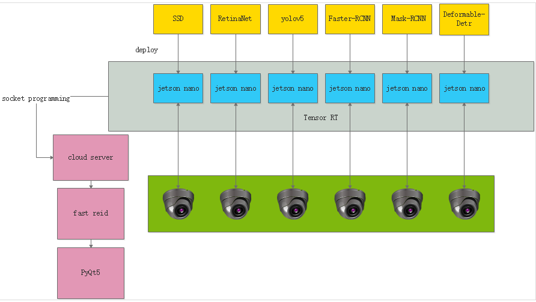

<!-- Improved compatibility of back to top link: See: https://github.com/othneildrew/Best-README-Template/pull/73 -->
<a name="readme-top"></a>
<!--
*** Thanks for checking out the Best-README-Template. If you have a suggestion
*** that would make this better, please fork the repo and create a pull request
*** or simply open an issue with the tag "enhancement".
*** Don't forget to give the project a star!
*** Thanks again! Now go create something AMAZING! :D
-->


<!-- PROJECT SHIELDS -->
<!--
*** I'm using markdown "reference style" links for readability.
*** Reference links are enclosed in brackets [ ] instead of parentheses ( ).
*** See the bottom of this document for the declaration of the reference variables
*** for contributors-url, forks-url, etc. This is an optional, concise syntax you may use.
*** https://www.markdownguide.org/basic-syntax/#reference-style-links
-->
[![Contributors][contributors-shield]][contributors-url]
[![Forks][forks-shield]][forks-url]
[![Stargazers][stars-shield]][stars-url]
[![Issues][issues-shield]][issues-url]
[![LinkedIn][linkedin-shield]][linkedin-url]


<!-- PROJECT LOGO -->
<br />
<div align="center">
<h3 align="center">Design and implementation of cluster object
detection system</h3>

  <p align="center">
    undergraduate project
    <br />
    <a href="https://github.com/fqt111/mmdetection-jetson-nano"><strong>Explore the docs »</strong></a>
    <br />
  </p>
</div>


<!-- TABLE OF CONTENTS -->
<details>
  <summary>Table of Contents</summary>
  <ol>
    <li>
      <a href="#about-the-project">About The Project</a>
      <ul>
        <li><a href="#implementation-steps">Implementation steps</a></li>
      </ul>
    </li>
    <li>
      <a href="#getting-started">Getting Started</a>
      <ul>
        <li><a href="#mmdetection">MMDetection</a></li>
      </ul>
      <ul>
        <li><a href="#jetson-nano-and-dd-backup">jetson nano & dd backup</a></li>
      </ul>
      <ul>
        <li><a href="#local-network-configuration">local network configuration</a></li>
      </ul>
      <ul>
        <li><a href="#build-socket-network">buile socket network</a></li>
      </ul>
      <ul>
        <li><a href="#fast-reid-tools">fast reid tools</a></li>
      </ul>
      <ul>
        <li><a href="#pyqt5">PyQt5</a></li>
      </ul>
    </li>
    <li><a href="#contact">Contact</a></li>
  </ol>
</details>


<!-- ABOUT THE PROJECT -->
## About The Project



With the development of deep learning, deep learning-based object detection methods have been widely used due to their excellent performance. Currently, classical object detection methods mainly include one-stage and two methods, but each method has its own advantages and disadvantages in terms of accuracy, speed, degree of recognition of object size, etc., and has its own applicability and limitations. This paper aims to study the collaborative mechanism of multiple object detection methods. First, using mmdetection to configured three one-stage algorithms (SSD, YOLO, RetinaNet) and three two-stage algorithms (Faster RCNN, Mask RCNN, Deformable Dert) for object detection training on the COCO dataset to analyze the applicability of different stage algorithms and the differences between different algorithms in the same stage; Second, taking yolov5 as an example, this algorithm model was deployed on Jetson Nano with a USB camera for inference acceleration using TensorRT; Thirdly, six object detection algorithms were horizontally deployed on six Jetson Nanos respectively and a local area network was built using a router; Fourthly, edge devices(six nanos) deployed in the same scenario, each camera is responsible for different perspectives and saves one frame a given seconds. The images are uniformly returned to a server using socket network for feature extraction, and use fast reid framework to obtain collaborative results. This project was tested on classroom with scores of persons. The pedestrian recognition mechanism can annotate the same person identified by different cameras. And given a person, this system can get a set of historical picture of that person. All the collaborative results can be shown in PyQt5.
<p align="right">(<a href="#readme-top">back to top</a>)</p>


### implementation steps
my implementation can be divided into seven part:
1) Configure jetson nano with necessary library to support object detection task
1) Use dd image backup technology to clone the development environment so as to easily expand one nano to six nanos without much works
2) Deploy six different object detection algorithms into six jetson nano devices with connected cameras, and use tensorrt to speed up inference time
3) Capture and send frames on each device using opencv and socket
4) receive corresponding results from edge devices to a server
5) using result position to clip the image and get each person image
6) Extract features from received images using fast reid
7) Calculate cross-camera distances between features using cosine similarity
9) compare each query image with every gallery image by similarity to judge whether the person is same or not
10) plot raw image with collaborative results and using PyQt5 to show the results

<p align="right">(<a href="#readme-top">back to top</a>)</p>

<!-- GETTING STARTED -->
## Getting Started

#### MMDetection
1. MMDetection is an open-source object detection toolkit based on PyTorch. It supports many state-of-the-art object detection algorithms, including both one-stage and two-stage detectors.This is an example of how to list things you need to use the software and how to install them.

##### Installation
1. Please refer to [Installation](https://mmdetection.readthedocs.io/en/latest/get_started.html) for installation MMDetection instructions.

| category  |  Backbone  |      Model      | Inf time (fps) | box AP |                                                                   Config                                                                    |                                                                                                  Download                                                                                                   |
| :-------: | :--------: | :-------------: | :------------: | :----: | :-----------------------------------------------------------------------------------------------------------------------------------------: | :---------------------------------------------------------------------------------------------------------------------------------------------------------------------------------------------------------: |
| stage one |   VGG16    |       SSD       |      43.7      |  25.5  |                          [config](https://github.com/open-mmlab/mmdetection/blob/main/configs/ssd/ssd300_coco.py)                           |                                              [model](https://download.openmmlab.com/mmdetection/v2.0/ssd/ssd300_coco/ssd300_coco_20210803_015428-d231a06e.pth)                                              |
| stage one | DarkNet-53 |      Yolo       |       45       |  36.8  |                 [config](https://github.com/open-mmlab/mmdetection/blob/main/configs/yolo/yolov3_d53_8xb8-320-273e_coco.py)                 |                                        [model](https://download.openmmlab.com/mmdetection/v2.0/yolo/yolov3_d53_320_273e_coco/yolov3_d53_320_273e_coco-421362b6.pth)                                         |
| stage one |  R-50-FPN  |    Retinanet    |       19       |  36.5  |                [config](https://github.com/open-mmlab/mmdetection/blob/main/configs/retinanet/retinanet_r50_fpn_1x_coco.py)                 |                                [model](https://download.openmmlab.com/mmdetection/v2.0/retinanet/retinanet_r50_fpn_1x_coco/retinanet_r50_fpn_1x_coco_20200130-c2398f9e.pth)                                 |
| stage two |  R-50-FPN  |   Faster-RCNN   |      21.4      |  37.4  |              [config](https://github.com/open-mmlab/mmdetection/blob/main/configs/faster_rcnn/faster-rcnn_r50_fpn_1x_coco.py)               |                             [model](https://download.openmmlab.com/mmdetection/v2.0/faster_rcnn/faster_rcnn_r50_fpn_1x_coco/faster_rcnn_r50_fpn_1x_coco_20200130-047c8118.pth)                              |
| stage two |  R-50-FP   |   Mask R-CNN    |      16.1      |  38.2  |                [config](https://github.com/open-mmlab/mmdetection/blob/main/configs/mask_rcnn/mask-rcnn_r50_fpn_1x_coco.py)                 |                                [model](https://download.openmmlab.com/mmdetection/v2.0/mask_rcnn/mask_rcnn_r50_fpn_1x_coco/mask_rcnn_r50_fpn_1x_coco_20200205-d4b0c5d6.pth)                                 |
| stage two |    R-50    | Deformable DETR |       15       |  47.0  | [config](https://github.com/open-mmlab/mmdetection/blob/main/configs/deformable_detr/deformable-detr-refine-twostage_r50_16xb2-50e_coco.py) | [model](https://download.openmmlab.com/mmdetection/v3.0/deformable_detr/deformable-detr-refine-twostage_r50_16xb2-50e_coco/deformable-detr-refine-twostage_r50_16xb2-50e_coco_20221021_184714-acc8a5ff.pth) |

The following are some of analysis between these six models.
One-stage and two-stage object detection algorithms are based on the way they perform object detection. One-stage algorithms directly predict the location and class of the objects in a single step, while two-stage algorithms first generate region proposals, and then refine them to predict the object class and location.
1) One-stage Object Detection Algorithms:
+ Single Shot Detector (SSD): SSD is a one-stage object detection algorithm that uses a single neural network to predict the bounding boxes and class probabilities for multiple objects in a single shot. SSD is known for its high accuracy, speed, and efficiency. It uses a multi-scale feature map to detect objects of different sizes and aspect ratios. However, it may struggle with detecting small objects.
+ You Only Look Once (YOLO): YOLO is another one-stage object detection algorithm that uses a single neural network to predict the bounding boxes and class probabilities for multiple objects in a single shot. YOLO is known for its real-time object detection capabilities and its ability to detect small objects. YOLO also uses a multi-scale feature map to detect objects of different sizes and aspect ratios.
+ RetinaNet: RetinaNet is a one-stage object detection algorithm that uses a feature pyramid network to detect objects at multiple scales. RetinaNet addresses the class imbalance problem in one-stage object detection algorithms by using a focal loss function that gives more weight to hard examples.
2) Two-stage Object Detection Algorithms:
- Faster R-CNN: Faster R-CNN is a two-stage object detection algorithm that uses a region proposal network (RPN) to generate region proposals and a second network to refine the proposals and predict the object class and location. Faster R-CNN is known for its high accuracy, but it may be slower than one-stage algorithms.
- Mask R-CNN: Mask R-CNN is an extension of Faster R-CNN that adds a third branch to the network to predict object masks in addition to the object class and location. Mask R-CNN is known for its accurate object detection and segmentation capabilities.
- Deformable Dert: Deformable Dert is a two-stage object detection algorithm that uses deformable convolutional networks to improve the accuracy of object detection. Deformable Dert is known for its ability to handle object deformations and occlusions and can achieve high accuracy even in challenging scenarios.
Overall, one-stage algorithms like SSD and YOLO are generally faster and more efficient but may struggle with detecting small objects, while two-stage algorithms like Faster R-CNN and Mask R-CNN are generally more accurate but may be slower. Deformable Dert is a more recent two-stage algorithm that aims to improve the accuracy of object detection, especially in challenging scenarios.
### jetson nano and dd backup


##### Installation

1. download the [official image](https://developer.nvidia.com/zh-cn/embedded/downloads) and burn into jetson nano
2. follow the [instruction](https://blog.csdn.net/happylearnerjsy/article/details/128484752?spm=1001.2101.3001.6650.3&utm_medium=distribute.pc_relevant.none-task-blog-2%7Edefault%7EYuanLiJiHua%7EPosition-3-128484752-blog-125957727.pc_relevant_landingrelevant&depth_1-utm_source=distribute.pc_relevant.none-task-blog-2%7Edefault%7EYuanLiJiHua%7EPosition-3-128484752-blog-125957727.pc_relevant_landingrelevant&utm_relevant_index=6) to prepare object detection environment
3. follow the [instruction](https://blog.csdn.net/weixin_56760882/article/details/126820313) to get backup image and copy the environment to other jetson nanos
4. testing the camera: using one of config and model in [MMDetection](#mmdetection) using [webcam_demo.py](https://github.com/open-mmlab/mmdetection/blob/main/demo/webcam_demo.py) to make the program run

<p align="right">(<a href="#readme-top">back to top</a>)</p>

### MMDetection to tensorrt
This [library](https://github.com/grimoire/mmdetection-to-tensorrt/tree/master) based on [MMDeploy](https://github.com/open-mmlab/mmdeploy) which is an open-source deep learning model deployment toolset. The library skips the usual conversion step of pth -> onnx -> tensorrt, directly converts from pth to tensorrt model, and has successfully supported many mmdetection model transformations.
#### usage
1. mmdetection to tensorrt and save model
```python
opt_shape_param=[
    [
        [1,3,320,320],      # min shape
        [1,3,800,1344],     # optimize shape
        [1,3,1344,1344],    # max shape
    ]
]
max_workspace_size=1<<30    # some module and tactic need large workspace.
trt_model = mmdet2trt(cfg_path, weight_path, opt_shape_param=opt_shape_param, fp16_mode=True, max_workspace_size=max_workspace_size)
torch.save(trt_model.state_dict(), save_path)
```
you can see the configuration file and weight model in [MMDetection](#mmdetection)

2. Use the transformed model for inference
```python
trt_model = init_detector(save_path)
num_detections, trt_bbox, trt_score, trt_cls = inference_detector(trt_model, image_path, cfg_path, "cuda:0")
```
more detail please see in the [documentation](https://github.com/grimoire/mmdetection-to-tensorrt/blob/master/README.md)

### local network configuration
Here is a detailed description of the steps to build a local area network with 6 Jetson Nano's and 1 host computer using a router:1. 

1. Prepare the hardware:
+ 6 Jetson Nano developer kits
+ 1 host computer (windows)
+ 1 router: xiaomi router

2. configure the network

- Log in to the router admin page, 192.168.31.1. Default username and password are admin.

- Select "Local Network" and set the router IP address, e.g. 192.168.0.1. Disable the DHCP server so we can manually assign fixed IP's to each device.

3. Assign IP addresses to each Jetson Nano and the host, e.g.:

- Jetson Nano 1-6: 192.168.0.2 - 192.168.0.7

- Host: 192.168.0.8

4. Save changes and restart the router.

Now the host and each Jetson Nano can access each other by IP, and the local area network is  set up. The steps above describe how to build a local area network with 6 Jetson Nano's and 1  host computer using a router. The devices are connected via the router and fixed IP's, allowing communication with each other. This network can be used for collaborative work across multiple devices, data transfer, etc.

### build socket network
build a socket connect to transfer image: create a threading timer, and every 30 seconds to build a connection to transfer image and results
construct two part of [server side](demo/server.py) and [client side](demo/camera.py)
the following are the schedule of collaboration between client and server to get 

1. client side: inference to get results
- post process the image to get bounding boxes, corresponding scores, classids. For each result, feed into plot_one_box function to put label into a specific position. This senario focus on person, and filter other results

2.  client side: send images and results to the server
- connect server and using opencv to read the real-time frame
- encode the image frame and send the length first and then send encoding data
- wait server reply and send result(object coordinate)

3.  server side: receive image and result position
4.  server side: cilp images according to object coordinate to get more specific results

in a short, the number of counter represent the time, and each jetson nano will transfer its current frame and detection results back to server side


### fast reid tools
[FastReID](https://github.com/JDAI-CV/fast-reid) is a research platform that implements state-of-the-art re-identification algorithms. You can install this library base on [documentation](fast_reid_README.md) 
since the frame and its corresponding results send back to server, and server create several folders. Then using fast reid tools and add some function to get feature map and calculate cosine similarity, which can be a importance indicator to guide the system to achieve pedestrian re-recognition.

1) [dataloader](fastreid\data\datasets\market1501.py) to get image path, person id, camera id, frame id

2) [calculate cosine similarity](demo/vis.py)

3) [get query id](fastreid\utils\visualizer.py). Open corresponding txt and find its person id, if not have, it will given a global counter person number

4) [judge gallery id](fastreid\utils\visualizer.py). If similarity more than 0.9, this person in the gallery can be recognized as the person in query, and give him a person id which is same with query person

5) give person id to txt and plot image with person id. So the six image from six jetson nano can be reallocated label and same person will get identity number.


### PyQt5
using PyQt5 to show results
1. show object detection result from six jetson nanos deploying six different algorithms, and indicate person id. Same person will own identity id while others will different.

1. Given a person, it can generate a set of historical image that are same with him, the following are two example, it will be sorted by the scores of similarity. The following shows ten person(at most ten persons even if more than ten from six frames) picture from latest six frames, and after choosing one of them will get a set of historical frames which are the same person.


<!-- CONTACT -->
## Contact

Name - Feng Qingtian - feng_qingtian@u.nus.edu

<p align="right">(<a href="#readme-top">back to top</a>)</p>


<!-- MARKDOWN LINKS & IMAGES -->
<!-- https://www.markdownguide.org/basic-syntax/#reference-style-links -->
[contributors-shield]: https://img.shields.io/github/contributors/fqt111/mmdetection-jetson-nano.svg?style=for-the-badge
[contributors-url]: https://github.com/fqt111/mmdetection-jetson-nano/graphs/contributors
[forks-shield]: https://img.shields.io/github/forks/fqt111/mmdetection-jetson-nano.svg?style=for-the-badge
[forks-url]: https://github.com/fqt111/mmdetection-jetson-nano/network/members
[stars-shield]: https://img.shields.io/github/stars/fqt111/mmdetection-jetson-nano.svg?style=for-the-badge
[stars-url]: https://github.com/fqt111/mmdetection-jetson-nano/stargazers
[issues-shield]: https://img.shields.io/github/issues/fqt111/mmdetection-jetson-nano.svg?style=for-the-badge
[issues-url]: https://github.com/fqt111/mmdetection-jetson-nano/issues
[license-shield]: https://img.shields.io/github/license/fqt111/mmdetection-jetson-nano.svg?style=for-the-badge
[license-url]: https://github.com/fqt111/mmdetection-jetson-nano/blob/master/LICENSE.txt
[linkedin-shield]: https://img.shields.io/badge/-LinkedIn-black.svg?style=for-the-badge&logo=linkedin&colorB=555
[linkedin-url]: https://www.linkedin.com/in/qingtian-feng-4b1055288/
[product-screenshot]: images/screenshot.png
